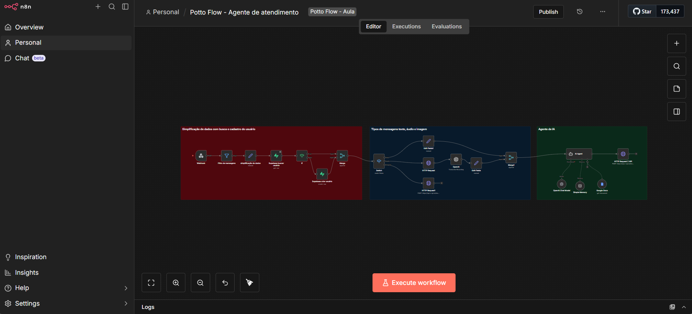
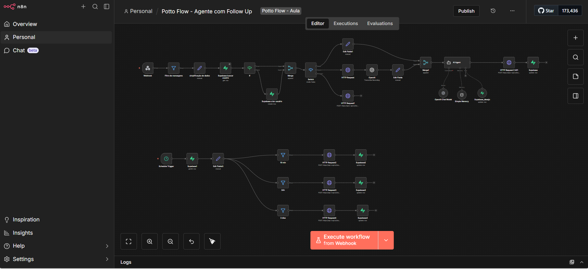
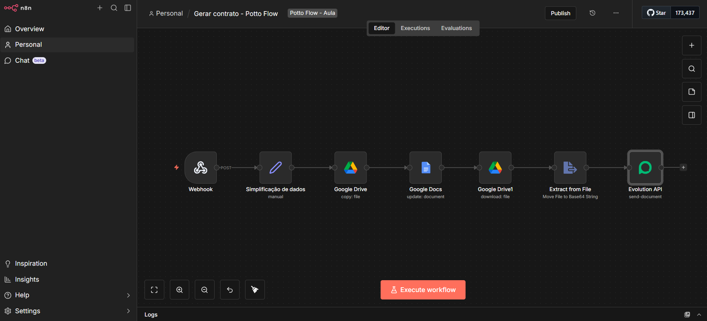
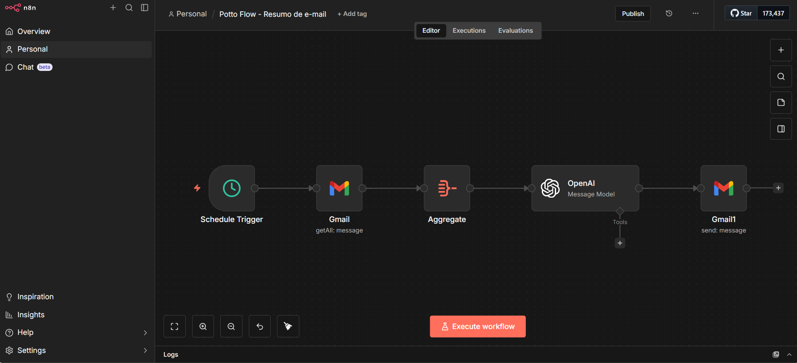
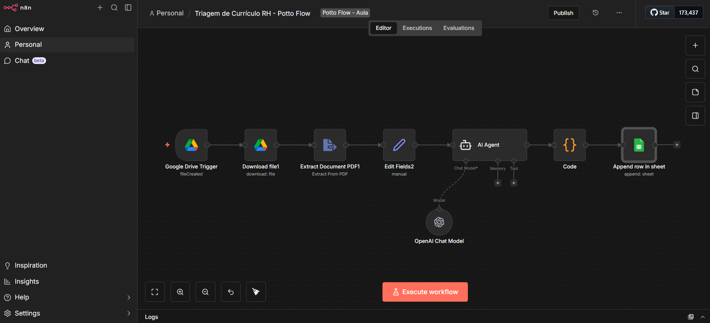

  ## Olá, eu sou o Diego Hugo 👋

💻 **AI Engineer | Inteligência Artificial, Automação & Full Stack**  
🤖 LLMs • Agentes Autônomos • RAG • LangGraph • n8n • APIs • Full Stack  

Sou **AI Engineer focado em Inteligência Artificial aplicada a negócios**, criando **soluções reais, escaláveis e orientadas a impacto**, combinando **LLMs, agentes inteligentes, automações, APIs e aplicações Full Stack**.

Este repositório reúne **projetos práticos**, **arquiteturas aplicadas** e **workflows reais de produção**, com mentalidade de **produto, operação e escala**.

---

## 🚀 Sobre mim

- 🤖 AI Engineer com foco em **LLMs, Agentes Autônomos e Sistemas Inteligentes**
- 🧠 IA aplicada a **produtos, processos, marketing, dados e operações**
- 🐍 Python para **IA, dados, automações e prototipação**
- 🟨 JavaScript / TypeScript para **backend, frontend e integrações**
- 🔁 Automação de processos com **n8n, Webhooks e APIs**
- 🌐 Desenvolvimento **Full Stack**
- 🗄️ Modelagem e uso de **bancos de dados SQL**
- 📚 Aprendizado contínuo com **aplicação prática em projetos reais**

---

## 🛠️ Tecnologias & Ferramentas

### 🤖 Inteligência Artificial


### 🔁 Automação & Integrações


### 🗄️ Dados & Persistência


### 🌐 Backend


### 🎨 Frontend


### 🎨 UI / CSS Frameworks


### 📦 Build & Bundler


### ⚙️ Infraestrutura & Deploy


---

## 📚 Portfólio — Python & Inteligência Artificial

Coleção de **projetos e estudos práticos** focados em **IA aplicada a problemas reais de negócio**, com visão de **arquitetura, produto e escala**.

### 🔹 LLMs & IA Aplicada
- IA aplicada a negócios e produtos  
- Finanças, Marketing, Atendimento e Operações  
- Human-in-the-loop  
- Análises explicáveis com LLMs  

### 🔹 Agentes Autônomos & LangGraph
- Agentic Workflows  
- Arquiteturas multi-agentes  
- Roteamento inteligente com LLMs  

### 🔹 RAG — Retrieval-Augmented Generation
- Pipelines RAG completos  
- Enriquecimento de contexto com embeddings  
- Recuperação semântica em bases vetoriais  

---

## 🔁 Portfólio — Automação com n8n

Workflows **n8n exportados**, baseados em **automações reais de produção**, focados em **eficiência operacional, integração de sistemas e IA aplicada**.

### 🔹 Automação de Processos
- Automatização de tarefas repetitivas  
- Execução orientada a eventos  
- Orquestração de processos de negócio  
- Redução de trabalho manual  

### 🔹 Integração de Sistemas
- Integração entre múltiplas APIs  
- Webhooks e conectores HTTP  
- Normalização e transformação de dados  

### 🔹 IA + Automação
- Integração de LLMs em workflows  
- Classificação e enriquecimento de dados  
- Tomada de decisão automatizada  
- Base para agentes inteligentes  

---

## 📂 Projetos em Destaque

### 🤖 Agente de Atendimento Inteligente (WhatsApp)



**Descrição:**  
Workflow completo de **Agente de Atendimento com IA**, desenvolvido no **n8n**, projetado para **responder clientes automaticamente via WhatsApp**, simulando o comportamento de uma **secretária humana**, com contexto, memória e integração com sistemas externos.

Este agente é ideal para **clínicas, consultórios, empresas de serviços e atendimento comercial**, realizando triagem inicial, respostas inteligentes e direcionamento correto das solicitações.

**O que esse agente faz na prática:**
- Recebe mensagens via **Webhook (WhatsApp API)**
- Filtra mensagens inválidas:
  - Grupos
  - Newsletters
  - Mensagens editadas
  - Mensagens enviadas pelo próprio número
- Normaliza e simplifica dados do usuário:
  - Nome
  - WhatsApp
  - Conteúdo da mensagem
- Busca ou cria automaticamente o cliente no **Supabase**
- Identifica o tipo de mensagem recebida:
  - 💬 Texto
  - 🎙️ Áudio (com transcrição automática via IA)
  - 🖼️ Imagem (resposta contextual orientando o usuário)
- Utiliza **Agente de IA (LLM)** com:
  - Prompt estruturado
  - Memória por usuário (histórico da conversa)
  - Tool Calling (Google Docs como base de conhecimento)
- Responde de forma **educada, natural e contextual**
- Envia mensagens automaticamente via **WhatsApp (Z-API)**

📁 **Workflow incluso:**  
`Potto_Flow___Agente_de_atendimento.json`

---

### 🤖 Agente com Follow Up Inteligente (WhatsApp)



**Descrição:**  
Workflow avançado de **Agente de IA com Follow Up automático**, desenvolvido no **n8n**, focado em **atendimento, qualificação e reengajamento de leads via WhatsApp**.

Este projeto simula um **assistente humano**, com **memória de conversa, entendimento de intenção do usuário e automações de acompanhamento temporal**, sendo ideal para clínicas, vendas, suporte ou pré-atendimento.

**O que esse agente faz na prática:**
- Recebe mensagens via **Webhook (WhatsApp API)**
- Filtra mensagens inválidas (grupos, newsletters, edições)
- Cria ou recupera usuários automaticamente no **Supabase**
- Processa **texto, áudio e imagem**
  - Áudio → transcrição automática via IA
- Utiliza **Agente de IA (LLM)** com:
  - Prompt estruturado
  - Memória por usuário
  - Tool Calling com banco de dados
- Identifica **intenção/desejo do usuário**
- Responde via **WhatsApp** de forma contextual
- Atualiza histórico e estágio do lead
- Executa **Follow Ups automáticos**:
  - ⏱️ 10 minutos
  - ⏱️ 24 horas
  - ⏱️ 3 dias

📁 **Workflow incluso:**  
`Potto_Flow___Agente_com_Follow_Up.json`

---

### 📄 Geração Automática de Contratos com IA (WhatsApp)



**Descrição:**  
Workflow de **geração automática de contratos**, desenvolvido no **n8n**, que transforma dados enviados via **Webhook** em um **contrato personalizado em PDF**, utilizando **Google Docs como template**, e envia o documento final diretamente ao cliente via **WhatsApp**.

Este fluxo é ideal para **prestadores de serviço, consultorias, agências e empresas**, eliminando processos manuais de criação de contratos, reduzindo erros e acelerando o fechamento com o cliente.

**O que esse workflow faz na prática:**
- Recebe dados do cliente via **Webhook (POST)**:
  - Nome
  - CPF/CNPJ
  - Endereço
  - Telefone
  - E-mail
- Normaliza e organiza os dados automaticamente
- Cria uma **cópia de um contrato modelo** no **Google Drive**
- Substitui campos dinâmicos no **Google Docs**:
  - `{nome-cliente}`
  - `{cpf-cnpj}`
  - `{endereco-cliente}`
  - `{telefone-cliente}`
  - `{email-cliente}`
- Converte o contrato automaticamente para **PDF**
- Transforma o arquivo em **Base64**
- Envia o contrato final via **WhatsApp**, utilizando **Evolution API**
- Mensagem automática de entrega para aprovação do cliente

📁 **Workflow incluso:**  
`Gerar contrato - Potto Flow.json`

---

### 📧 Resumo Inteligente de E-mails com IA (Gmail)



**Descrição:**  
Workflow de **resumo automático de e-mails**, desenvolvido no **n8n**, que coleta mensagens recebidas no **Gmail**, analisa o conteúdo com **Inteligência Artificial** e envia diariamente um **resumo estruturado com pontos-chave e ações recomendadas**.

Este projeto é ideal para **gestores, executivos, equipes comerciais e operações**, reduzindo tempo de leitura, evitando perda de informações importantes e facilitando a tomada de decisão diária.

**O que esse workflow faz na prática:**
- Executa automaticamente via **Schedule Trigger** (horário programado)
- Busca e-mails recebidos no **Gmail** dentro de um intervalo de tempo definido
- Agrega e normaliza os dados das mensagens:
  - Remetente
  - Destinatários
  - Conteúdo resumido
- Envia os dados para um **Agente de IA (OpenAI / LLM)** que:
  - Identifica os **principais pontos dos e-mails**
  - Extrai **problemas, decisões e informações relevantes**
  - Gera uma lista clara de **itens de ação**, associados a pessoas quando possível
- Retorna o resultado em **JSON estruturado**
- Envia automaticamente um **e-mail formatado em HTML**, contendo:
  - 📌 Resumo dos e-mails
  - ✅ Lista de ações recomendadas
- Facilita acompanhamento diário sem necessidade de leitura manual de múltiplos e-mails

📁 **Workflow incluso:**  
`Potto_Flow___Resumo_de_e_mail.json`

---

### 🧑‍💼 Triagem Inteligente de Currículos com IA (RH)



**Descrição:**  
Workflow completo de **triagem automatizada de currículos**, desenvolvido no **n8n**, que utiliza **Inteligência Artificial** para analisar currículos em **PDF**, comparar com uma **descrição de vaga específica** e gerar uma **avaliação estruturada do candidato**, pronta para decisão de RH.

Este projeto é ideal para **times de Recursos Humanos, recrutadores, consultorias de RH e empresas**, reduzindo drasticamente o tempo de análise manual e aumentando a consistência e qualidade das decisões de contratação.

**O que esse workflow faz na prática:**
- Monitora automaticamente uma **pasta no Google Drive**
- Detecta quando um **novo currículo em PDF** é adicionado
- Faz o **download automático do arquivo**
- Extrai o texto completo do currículo (**PDF → texto**)
- Injeta dinamicamente:
  - 📄 Descrição detalhada da vaga  
  - 🎯 Prompt de avaliação rigoroso de recrutador  
- Utiliza um **Agente de IA (OpenAI / LLM)** para:
  - Avaliar aderência do candidato à vaga
  - Identificar pontos fortes e fracos
  - Detectar possíveis **job hoppers**
  - Gerar um **percentual de compatibilidade**
- Retorna a análise em **formato estruturado**
- Normaliza os dados via **Code Node**
- Registra automaticamente os resultados em uma **planilha do Google Sheets**, incluindo:
  - Nome do candidato
  - Contato
  - Percentual de compatibilidade
  - Resumo do perfil
  - Razões para contratar
  - Razões para não contratar

Este fluxo cria um **pipeline de recrutamento inteligente**, escalável e auditável, pronto para uso em ambientes reais de RH.

📁 **Workflow incluso:**  
`Triagem de Currículo RH - Potto Flow.json`

---

## ⭐ Projeto em Destaque

### 📊 A Tríade — IA para Análise de Ações

Projeto **backend em Python** que integra **dados financeiros**, **notícias de mercado** e **Inteligência Artificial** para apoiar **análise de ações e tomada de decisão**.

**Pilares:**
- 📈 Dados de mercado  
- 📰 Contexto informacional  
- 🤖 Raciocínio estruturado com LLMs  

**Destaques técnicos:**
- API REST com **FastAPI**
- Arquitetura em camadas (**API, Services, AI, Schemas**)
- **Prompt Engineering** com structured outputs
- Base pronta para **RAG** e **agentes autônomos**
- Projeto **containerizado**

**Stack:**


---

## 🚀 Outros Projetos Relevantes

### 📄 OCR Document API — Full Stack

Aplicação **Full Stack** para **upload de imagens**, **extração de texto via OCR**, **persistência em banco de dados** e **busca textual**.

**Destaques técnicos:**
- OCR aplicado (**Computer Vision**)
- API REST
- Persistência relacional
- Arquitetura **containerizada**

### 🎨 Frontend


#### 🌐 Backend


---

### 🚀 Antigravity Financial — Plataforma Financeira com IA

Aplicação **web completa** construída com **FastAPI + Uvicorn**, **Docker** e **Docker Compose**, utilizando **Cloudflare D1** como banco de dados e **Redis** para **rate limiting**.

**Funcionalidades:**
- Autenticação completa (**Login, Registro, Logout**) com **JWT**
- **Rate limiting** com Redis (proteção contra força bruta)
- **Admin Panel** para aprovação de usuários
- **Dashboard financeiro** (Ações, FX e Cripto)
- Normalização de dados financeiros (**Base 100**)
- Integração com **Cloudflare D1 (REST API)** e **Financial Modeling Prep API**

**Destaques técnicos:**
- Arquitetura backend organizada por camadas
- Integração com serviços externos via API
- Segurança e controle de acesso
- Aplicação **containerizada** e pronta para produção

**Stack:**


---

## 🧾 Sistema de Cadastro de Usuários — Full Stack

Aplicação **Full Stack** para **cadastro, autenticação e gerenciamento de usuários**, construída com foco em **boas práticas de engenharia de software**, **organização de código**, **segurança básica** e **infraestrutura preparada para produção**.

O projeto demonstra domínio em **arquitetura Full Stack moderna**, **API REST**, **persistência de dados**, **containerização** e **deploy**.

---

## 🚀 Funcionalidades

- Cadastro de usuários
- Login e autenticação
- Validação de dados no backend
- Persistência em banco de dados relacional
- Arquitetura simples, organizada e escalável

---

## 🧠 Destaques Técnicos

- API REST bem definida
- Separação clara de responsabilidades:
  - `routes`
  - `controllers`
  - `services`
- Validações centralizadas no backend
- Projeto **containerizado**
- Base preparada para evolução com:
  - JWT
  - Refresh Tokens
  - RBAC (Role-Based Access Control)
- Infraestrutura pronta para ambientes reais

---

## 🛠️ Stack Tecnológica

### 🎨 Frontend
- **Next.js**
- **React**
- **TypeScript**
- **CSS / CSS Modules**
- Deploy moderno com **Vercel**


---

### 🌐 Backend
- **Node.js**
- **Express**
- **TypeScript**
- Arquitetura em camadas
- Validações no servidor


---

### 🗄️ Dados
- **PostgreSQL**
- **SQL**
- Persistência relacional
- Modelagem simples e eficiente


---

### ⚙️ Infraestrutura & Deploy
- **Docker**
- **Docker Compose**
- **Traefik** como proxy reverso
- Ambientes isolados e reproduzíveis
- Pronto para produção


---

### 🔗 Comunicação
- **API REST**
- Comunicação via HTTP
- Integração Frontend ↔ Backend
- Base pronta para autenticação e autorização

---

## 🎯 Objetivo do Projeto

Demonstrar capacidade prática em:
- Desenvolvimento **Full Stack**
- Arquitetura de APIs
- Organização e escalabilidade de código
- Infraestrutura moderna com containers
- Deploy profissional (Vercel + Docker + Traefik)

---

⭐ Projeto desenvolvido para portfólio técnico, entrevistas e evolução para aplicações de produção.

---

## 🖼️ Projeto Galeria de Imagens — Full Stack

O **Projeto Galeria de Imagens** é uma aplicação **Full Stack** desenvolvida para demonstrar **boas práticas de arquitetura**, **organização de código** e **separação clara de responsabilidades** entre **Frontend, Backend, Banco de Dados e Infraestrutura**.

O projeto foi concebido com foco em **escalabilidade**, **modularidade** e **preparação para produção**, sendo ideal tanto para **estudos avançados** quanto para **portfólio profissional**.

---

## 🚀 Funcionalidades

- 📸 Upload e exibição de imagens  
- 🗂️ Galeria organizada e responsiva  
- 🌐 Comunicação entre camadas via **API REST**  
- 🧩 Componentização e reutilização de templates  
- 📦 Build otimizado para frontend  
- 🐳 Ambiente totalmente containerizado  
- ⚡ Estrutura pronta para deploy  

---

## 🧠 Destaques Técnicos

- Arquitetura Full Stack bem definida
- Separação clara de responsabilidades:
  - Frontend
  - Backend
  - Banco de Dados
  - Infraestrutura
- Comunicação via API REST
- Build frontend com bundler moderno
- Containerização completa com Docker
- Base preparada para CI/CD e cloud

---

## 🛠️ Stack Tecnológica

### 🎨 Frontend
- **HTML5**
- **CSS3**
- **JavaScript**
- **Bootstrap**
- **jQuery**
- Templates reutilizáveis
- Layout responsivo


---

### 📦 Build & Bundler
- **Webpack**
- Build otimizado para produção
- Geração de bundle final


---

### 🌐 Backend
- **Node.js**
- **TypeScript**
- **Express**
- API REST estruturada
- Organização em camadas:
  - controllers
  - routes
  - services


---

### 🗄️ Banco de Dados
- **PostgreSQL**
- Persistência relacional
- Modelagem simples e eficiente


---

### ⚙️ Infraestrutura & DevOps
- **Docker**
- **Docker Compose**
- Ambientes isolados e reproduzíveis
- Orquestração de múltiplos serviços
- Base preparada para deploy em cloud


---

## 📂 Estrutura do Projeto

```
projeto-galeria/
│
├── backend/
│   ├── src/
│   │   ├── controllers/
│   │   ├── routes/
│   │   ├── services/
│   │   └── app.ts
│   ├── Dockerfile
│   └── package.json
│
├── frontend/
│   ├── src/
│   │   ├── js/
│   │   ├── styles/
│   │   └── templates/
│   ├── build/
│   │   ├── imgs/
│   │   ├── bundle.js
│   │   └── index.html
│   ├── webpack.config.js
│   └── package.json
│
├── docker-compose.yml
├── .gitignore
└── README.md
```
▶️ Como Executar o Projeto
🐳 Executar com Docker
bash
copiar código
docker-compose up --build
💻 Executar Manualmente
Backend
bash
copiar código
cd backend
npm install
npm run dev
Frontend
bash
copiar código
cd frontend
npm install
npm run build
Abra no navegador:

bash
copiar código
frontend/build/index.html

🎯 Objetivo do Projeto
Demonstrar domínio em desenvolvimento Full Stack

Aplicar arquitetura organizada e escalável

Utilizar API REST

Trabalhar com Docker e Docker Compose

Servir como projeto sólido de portfólio profissional

🔮 Evoluções Futuras
🔐 Autenticação com JWT

☁️ Upload de imagens em cloud

⚛️ Migração para React ou Vue

📊 Dashboard administrativo

🚀 Pipeline CI/CD

👨‍💻 Autor: Diego Hugo

⭐ Se este projeto te ajudou ou inspirou, considere deixar uma estrela!


---

## 📊 GitHub Stats


---

## 📫 Onde me encontrar

- 💼 LinkedIn: https://linkedin.com/in/diegohrocha  
- 🐙 GitHub: https://github.com/diegohugo570  

---
⭐ Se algum projeto te ajudou, considere deixar uma estrela!
