  ## Olá, eu sou o Diego Hugo 👋

💻 **AI Engineer | Inteligência Artificial, Automação & Full Stack**  
🤖 LLMs • Agentes Autônomos • RAG • LangGraph • n8n • APIs • Full Stack  

Sou **AI Engineer focado em Inteligência Artificial aplicada a negócios**, criando **soluções reais, escaláveis e orientadas a impacto**, combinando **LLMs, agentes inteligentes, automações, APIs e aplicações Full Stack**.

Este repositório reúne **projetos práticos**, **arquiteturas aplicadas** e **workflows reais de produção**, com mentalidade de **produto, operação e escala**.

---

## 🚀 Sobre mim

- 🤖 AI Engineer com foco em **LLMs, Agentes Autônomos e Sistemas Inteligentes**
- 🧠 IA aplicada a **produtos, processos, marketing, dados e operações**
- 🐍 Python para **IA, dados, automações e prototipação**
- 🟨 JavaScript / TypeScript para **backend, frontend e integrações**
- 🔁 Automação de processos com **n8n, Webhooks e APIs**
- 🌐 Desenvolvimento **Full Stack**
- 🗄️ Modelagem e uso de **bancos de dados SQL**
- 📚 Aprendizado contínuo com **aplicação prática em projetos reais**

---

## 🛠️ Tecnologias & Ferramentas

### 🤖 Inteligência Artificial


### 🔁 Automação & Integrações


### 🗄️ Dados & Persistência


### 🌐 Backend


### 🎨 Frontend


### 🎨 UI / CSS Frameworks


### 📊 Dados & Análise


### 📦 Build & Bundler


### ⚙️ Infraestrutura & Deploy


---

## 📚 Portfólio — Python & Inteligência Artificial

Coleção de **projetos e estudos práticos** focados em **IA aplicada a problemas reais de negócio**, com visão de **arquitetura, produto e escala**.

### 🔹 LLMs & IA Aplicada
- Aplicação estratégica de LLMs em produtos e sistemas corporativos  
- Casos práticos em Finanças, Marketing, Atendimento, RH e Operações  
- Human-in-the-Loop para validação e controle de decisões críticas  
- Structured Outputs e geração de respostas auditáveis  
- Prompt Engineering avançado (roteamento, decomposição de tarefas, raciocínio estruturado)  
- Integração de LLMs com APIs, bancos de dados e fluxos automatizados  

### 🔹 Agentes Autônomos & LangGraph
- Construção de Agentic Workflows orientados a estados  
- Arquiteturas multi-agentes com separação de responsabilidades  
- Roteamento inteligente com LLM Routing  
- Orquestração de ferramentas externas (APIs, banco de dados, funções)  
- Controle de fluxo com memória, checkpoints e persistência  
- Aplicação prática em automações e sistemas orientados a decisão  

### 🔹 RAG — Retrieval-Augmented Generation
- Construção de pipelines RAG completos (ingestão → indexação → recuperação → geração)  
- Estratégias de chunking e pré-processamento de documentos  
- Criação e uso de embeddings  
- Armazenamento em bases vetoriais (Vector DB / pgvector)  
- Recuperação semântica com busca híbrida  
- Enriquecimento dinâmico de contexto para respostas mais precisas e fundamentadas  
- Aplicação em bases privadas de conhecimento e sistemas corporativos  

---

# ⭐ Projetos em Destaque

## 🚀 1️⃣ Text2SQL Agent

Agente inteligente capaz de:

- Receber perguntas em linguagem natural  
- Interpretar intenção do usuário  
- Gerar queries SQL automaticamente  
- Consultar banco de dados  
- Retornar respostas estruturadas  

### Tecnologias:
- Python  
- LLMs  
- Arquitetura de Agente  
- Orquestração de fluxo  

Aplicação prática de IA para análise de dados orientada por linguagem natural.

---

## ⚡ 2️⃣ API Profissional com FastAPI

Projeto estruturado utilizando:

- FastAPI  
- Docker  
- Docker Compose  
- Alembic (migrations)  
- Arquitetura modular  
- Variáveis de ambiente  
- Estrutura pronta para produção  

### Conceitos aplicados:
- Criação de rotas REST  
- Validação com Pydantic  
- Separação por camadas  
- Organização profissional de projeto  
- Preparação para deploy  

Projeto voltado para construção de APIs modernas e escaláveis em Python.

---

## 🌦️ 3️⃣ AUS Weather — Projeto de Análise de Dados

Projeto de análise e manipulação de dados climáticos aplicando:

- Fundamentos de Python  
- Estruturação lógica  
- Limpeza e manipulação de dados  

Representa a consolidação da base técnica para evoluções em Data Science e IA.

---

## 🏆 4️⃣ Prompt Packer
Script de engenharia de prompt que:

- Recebe via terminal:
  - Role  
  - Tom de voz  
  - Tarefa  
  - Número máximo de palavras  

- Monta prompt estruturado com f-strings  
- Estima quantidade de palavras (1 palavra ≈ 6.11 caracteres)  
- Valida se está dentro do intervalo aceitável (±10 palavras)  

Aplicação prática de controle de saída de LLMs.
```python
# Exemplo de uso
prompt_final = f"""
# Role
{role}

# Tom de voz
{tom_de_voz}

# Tarefa
{tarefa}

Pense passo a passo antes de responder.
"""
palavras_estimadas = len(prompt_final) // 6.11
dentro_do_intervalo = numero_maximo - 10 <= palavras_estimadas <= numero_maximo + 10
```
---

## 🏆 5️⃣ Persistent Chat History
Chat de terminal com memória persistente:

- Lê histórico salvo em `.txt`  
- Loop contínuo até `/stop`  
- Salvamento incremental com `with open()`  
- Estrutura organizada por roles  

Aplicação de persistência e controle de contexto.
```python
# Salvando histórico
with open("./modulo_2/conversation_history.txt", "a") as historico:
    for message in new_messages:
        historico.write(f"{message['role']}: {message['content']}\n")
```
       
---

## 🏆 6️⃣ Token Cost Calculator
Mini-biblioteca para estimar custo mensal de modelos:

- Tabela de custo por modelo  
- Cálculo baseado em tokens de entrada e saída  
- Consideração de janela de contexto crescente  
- Registro automático em `log.txt`  

Aplicação prática de controle financeiro de LLMs.
```python
CUSTO_MODELOS_DOLAR = {
    "gpt-5.1": {"input": 1.25, "output": 10},
    "claude-4.5-opus": {"input": 5, "output": 25}
}

def calcular_custo_total(modelo: str,
                         tokens_system_prompt: int,
                         media_tokens_input: int,
                         media_tokens_output: int,
                         media_mensagens_por_dia: int) -> float:
    # Considera janela de contexto crescente
    # Registra cada cálculo em log.txt
```

---

## 🏆 7️⃣ Model Provider SDK
Mini-SDK orientado a objetos:

- Classe base abstrata  
- Simulação de provedores  
- Validação de API Key  
- Controle de latência  
- Padronização de retorno  

Aplicação de POO para arquitetura extensível.
```python
class ModeloBase:
    def invoke(self, prompt: str, api_key: str) -> str:
        raise NotImplementedError("Subclasses devem implementar este método")

class OpenAIModel(ModeloBase):
    def invoke(self, prompt: str, api_key: str = OPENAI_API_KEY) -> str:
        if not api_key.startswith("sk-"):
            raise ValueError("API Key inválida")
        time.sleep(3)  # Simula latência
        return {"model": self.nome, "output": "Resposta da OpenAI", "temperatura": self.temperatura}
```

---

## 🏆 8️⃣ Simple Vector Store
Armazenamento vetorial em memória com:

- Vetores NumPy  
- Cálculo de similaridade por distância de cosseno  
- Ordenação por menor distância  
- Retorno Top-K  

Base para sistemas RAG customizados.
```python
class VectorStore:
    def query(self, query: np.array, k: int) -> list:
        distances = []
        for document, vector in zip(self.documents, self.vectors):
            # Distância de cosseno
            distance = 1 - (np.dot(query, vector) /
                          (np.linalg.norm(query) * np.linalg.norm(vector)))
            distances.append((distance, document))

        distances.sort(key=lambda x: x[0])
        return distances[:k]
```

---

## 🏆 9️⃣ Fine-Tuning Dataset Prepper
Pipeline ETL completo:

- Normalização de roles (human/ai)  
- Remoção de dados sensíveis  
- Parse de datas  
- Deduplicação  
- Transformação para JSONL  
- Exportação pronta para fine-tuning  

Aplicação real de engenharia de dados para IA.
```python
class ETL:
    def pipeline(self) -> pd.DataFrame:
        df = self.normalize_sender(self.data)      # human/ai
        df = self.normalize_content(df)            # Remove PIIs
        df = self.normalize_created_at(df)         # Parse datas
        df = self.remove_duplicates(df)            # Deduplicação
        jsonl = self.transform_data(df)            # Formato JSONL
        self.export_data(jsonl)                    # training_data.jsonl
        return df
```

Saída no formato para Fine-Tuning:
```python
{
  "messages": [
    { "role": "user", "content": "..." },
    { "role": "assistant", "content": "..." }
  ]
}
```

---

## 🏆 🔟 Token Usage Dashboard
Dashboard orientado a objetos para análise de datasets:

- Leitura de JSONL  
- Estimativa de tokens  
- Classificação de tópicos por regras  
- Geração de histogramas e gráficos  

Aplicação de análise quantitativa em datasets de treinamento.
```python
# Estrutura de classes
DatasetReader   → Carrega e extrai textos do JSONL
TokenStats      → Estima tokens e classifica tópicos
DashboardPlotter → Gera histograma + gráfico de barras

# Classificação por regras
TOPIC_RULES = {
  "Cancelamento": ["cancel", "cancelar", "assinatura"],
  "Cobrança/Pagamento": ["cobran", "cartão", "pagamento"],
  "App/Erro": ["trava", "erro", "bug"],
  ...
}
```

---

## 🏆 1️⃣1️⃣ The CLI Assistant
Assistente de terminal com:

- Memória persistente  
- Ferramentas integradas (contagem de palavras, data/hora)  
- Estrutura baseada em agente  
- Loop interativo  
- Integração com modelo LLM  

Aplicação prática de arquitetura agentic em ambiente CLI.
```python
class CLIAssistant:
    def __init__(self, model: str, system_prompt: str, history_path: str):
        self.agent = create_agent(self.model, tools=[
            get_current_time,      # Retorna data/hora atual
            count_words_in_phrase  # Conta palavras em frase
        ])

    def run(self) -> None:
        while True:
            user_input = input("Você: ")
            if user_input == "/stop":
                break
            response = self.message_agent(HumanMessage(content=user_input))
            print(f"AI: {response}")
```            

---

## 🔁 Portfólio — Automação com n8n

Workflows **n8n exportados**, baseados em **automações reais de produção**, focados em **eficiência operacional, integração de sistemas e IA aplicada**.

### 🔹 Automação de Processos
- Automatização de tarefas repetitivas  
- Execução orientada a eventos  
- Orquestração de processos de negócio  
- Redução de trabalho manual  

### 🔹 Integração de Sistemas
- Integração entre múltiplas APIs  
- Webhooks e conectores HTTP  
- Normalização e transformação de dados  

### 🔹 IA + Automação
- Integração de LLMs em workflows  
- Classificação e enriquecimento de dados  
- Tomada de decisão automatizada  
- Base para agentes inteligentes  

---

## 📂 Projetos em Destaque

### 🤖 Agente de Atendimento Inteligente (WhatsApp)


**Descrição:**  
Workflow completo de **Agente de Atendimento com IA**, desenvolvido no **n8n**, projetado para **responder clientes automaticamente via WhatsApp**, simulando o comportamento de uma **secretária humana**, com contexto, memória e integração com sistemas externos.

Este agente é ideal para **clínicas, consultórios, empresas de serviços e atendimento comercial**, realizando triagem inicial, respostas inteligentes e direcionamento correto das solicitações.

**O que esse agente faz na prática:**
- Recebe mensagens via **Webhook (WhatsApp API)**
- Filtra mensagens inválidas:
  - Grupos
  - Newsletters
  - Mensagens editadas
  - Mensagens enviadas pelo próprio número
- Normaliza e simplifica dados do usuário:
  - Nome
  - WhatsApp
  - Conteúdo da mensagem
- Busca ou cria automaticamente o cliente no **Supabase**
- Identifica o tipo de mensagem recebida:
  - 💬 Texto
  - 🎙️ Áudio (com transcrição automática via IA)
  - 🖼️ Imagem (resposta contextual orientando o usuário)
- Utiliza **Agente de IA (LLM)** com:
  - Prompt estruturado
  - Memória por usuário (histórico da conversa)
  - Tool Calling (Google Docs como base de conhecimento)
- Responde de forma **educada, natural e contextual**
- Envia mensagens automaticamente via **WhatsApp (Z-API)**

📁 **Workflow incluso:**  
`Potto_Flow___Agente_de_atendimento.json`

---

### 🤖 Agente com Follow Up Inteligente (WhatsApp)


**Descrição:**  
Workflow avançado de **Agente de IA com Follow Up automático**, desenvolvido no **n8n**, focado em **atendimento, qualificação e reengajamento de leads via WhatsApp**.

Este projeto simula um **assistente humano**, com **memória de conversa, entendimento de intenção do usuário e automações de acompanhamento temporal**, sendo ideal para clínicas, vendas, suporte ou pré-atendimento.

**O que esse agente faz na prática:**
- Recebe mensagens via **Webhook (WhatsApp API)**
- Filtra mensagens inválidas (grupos, newsletters, edições)
- Cria ou recupera usuários automaticamente no **Supabase**
- Processa **texto, áudio e imagem**
  - Áudio → transcrição automática via IA
- Utiliza **Agente de IA (LLM)** com:
  - Prompt estruturado
  - Memória por usuário
  - Tool Calling com banco de dados
- Identifica **intenção/desejo do usuário**
- Responde via **WhatsApp** de forma contextual
- Atualiza histórico e estágio do lead
- Executa **Follow Ups automáticos**:
  - ⏱️ 10 minutos
  - ⏱️ 24 horas
  - ⏱️ 3 dias

📁 **Workflow incluso:**  
`Potto_Flow___Agente_com_Follow_Up.json`

---

### 📄 Geração Automática de Contratos com IA (WhatsApp)


**Descrição:**  
Workflow de **geração automática de contratos**, desenvolvido no **n8n**, que transforma dados enviados via **Webhook** em um **contrato personalizado em PDF**, utilizando **Google Docs como template**, e envia o documento final diretamente ao cliente via **WhatsApp**.

Este fluxo é ideal para **prestadores de serviço, consultorias, agências e empresas**, eliminando processos manuais de criação de contratos, reduzindo erros e acelerando o fechamento com o cliente.

**O que esse workflow faz na prática:**
- Recebe dados do cliente via **Webhook (POST)**:
  - Nome
  - CPF/CNPJ
  - Endereço
  - Telefone
  - E-mail
- Normaliza e organiza os dados automaticamente
- Cria uma **cópia de um contrato modelo** no **Google Drive**
- Substitui campos dinâmicos no **Google Docs**:
  - `{nome-cliente}`
  - `{cpf-cnpj}`
  - `{endereco-cliente}`
  - `{telefone-cliente}`
  - `{email-cliente}`
- Converte o contrato automaticamente para **PDF**
- Transforma o arquivo em **Base64**
- Envia o contrato final via **WhatsApp**, utilizando **Evolution API**
- Mensagem automática de entrega para aprovação do cliente

📁 **Workflow incluso:**  
`Gerar contrato - Potto Flow.json`

---

### 📧 Resumo Inteligente de E-mails com IA (Gmail)


**Descrição:**  
Workflow de **resumo automático de e-mails**, desenvolvido no **n8n**, que coleta mensagens recebidas no **Gmail**, analisa o conteúdo com **Inteligência Artificial** e envia diariamente um **resumo estruturado com pontos-chave e ações recomendadas**.

Este projeto é ideal para **gestores, executivos, equipes comerciais e operações**, reduzindo tempo de leitura, evitando perda de informações importantes e facilitando a tomada de decisão diária.

**O que esse workflow faz na prática:**
- Executa automaticamente via **Schedule Trigger** (horário programado)
- Busca e-mails recebidos no **Gmail** dentro de um intervalo de tempo definido
- Agrega e normaliza os dados das mensagens:
  - Remetente
  - Destinatários
  - Conteúdo resumido
- Envia os dados para um **Agente de IA (OpenAI / LLM)** que:
  - Identifica os **principais pontos dos e-mails**
  - Extrai **problemas, decisões e informações relevantes**
  - Gera uma lista clara de **itens de ação**, associados a pessoas quando possível
- Retorna o resultado em **JSON estruturado**
- Envia automaticamente um **e-mail formatado em HTML**, contendo:
  - 📌 Resumo dos e-mails
  - ✅ Lista de ações recomendadas
- Facilita acompanhamento diário sem necessidade de leitura manual de múltiplos e-mails

📁 **Workflow incluso:**  
`Potto_Flow___Resumo_de_e_mail.json`

---

### 🧑‍💼 Triagem Inteligente de Currículos com IA (RH)


**Descrição:**  
Workflow completo de **triagem automatizada de currículos**, desenvolvido no **n8n**, que utiliza **Inteligência Artificial** para analisar currículos em **PDF**, comparar com uma **descrição de vaga específica** e gerar uma **avaliação estruturada do candidato**, pronta para decisão de RH.

Este projeto é ideal para **times de Recursos Humanos, recrutadores, consultorias de RH e empresas**, reduzindo drasticamente o tempo de análise manual e aumentando a consistência e qualidade das decisões de contratação.

**O que esse workflow faz na prática:**
- Monitora automaticamente uma **pasta no Google Drive**
- Detecta quando um **novo currículo em PDF** é adicionado
- Faz o **download automático do arquivo**
- Extrai o texto completo do currículo (**PDF → texto**)
- Injeta dinamicamente:
  - 📄 Descrição detalhada da vaga  
  - 🎯 Prompt de avaliação rigoroso de recrutador  
- Utiliza um **Agente de IA (OpenAI / LLM)** para:
  - Avaliar aderência do candidato à vaga
  - Identificar pontos fortes e fracos
  - Detectar possíveis **job hoppers**
  - Gerar um **percentual de compatibilidade**
- Retorna a análise em **formato estruturado**
- Normaliza os dados via **Code Node**
- Registra automaticamente os resultados em uma **planilha do Google Sheets**, incluindo:
  - Nome do candidato
  - Contato
  - Percentual de compatibilidade
  - Resumo do perfil
  - Razões para contratar
  - Razões para não contratar

Este fluxo cria um **pipeline de recrutamento inteligente**, escalável e auditável, pronto para uso em ambientes reais de RH.

📁 **Workflow incluso:**  
`Triagem de Currículo RH - Potto Flow.json`

---

### 🛒 Infoproduto com Recuperação de Checkout (WhatsApp)

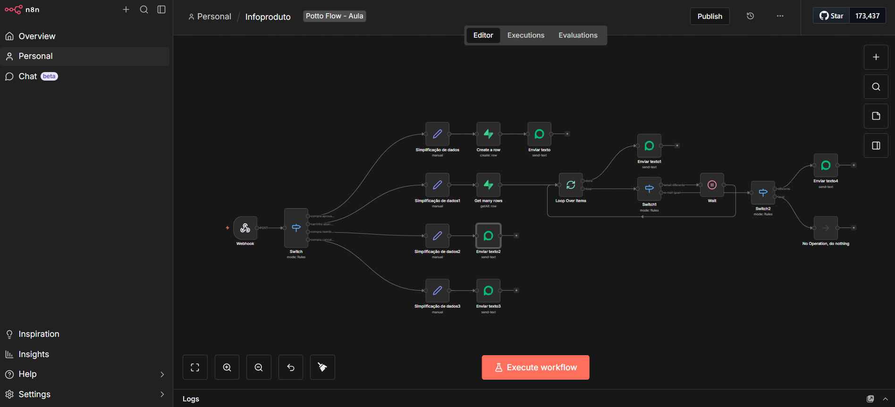

**Descrição:**  
Workflow avançado de **automação de vendas de infoprodutos**, desenvolvido no **n8n**, focado em **atendimento automatizado, recuperação de checkout abandonado e follow up inteligente via WhatsApp**.

Este projeto foi desenhado para **produtores digitais, lançadores, afiliados e infoprodutores**, automatizando o contato com leads, aumentando taxa de conversão e reduzindo esforço manual no pós-clique.

**O que esse workflow faz na prática:**
- Recebe eventos via **Webhook** (ex: lead, checkout iniciado, checkout abandonado)
- Normaliza e simplifica os dados do lead:
  - Nome
  - WhatsApp
  - Produto de interesse
  - Status do funil
- Identifica automaticamente o **estágio do lead**:
  - Novo lead
  - Checkout iniciado
  - Checkout abandonado
  - Compra finalizada
- Executa **fluxos condicionais** com **Switch + Regras**
- Envia mensagens personalizadas via **WhatsApp**, como:
  - Boas-vindas ao infoproduto
  - Lembrete de checkout abandonado
  - Reforço de benefícios do produto
  - Gatilhos de urgência e escassez
- Implementa **timers estratégicos** com **Wait Node**:
  - ⏱️ minutos após abandono
  - ⏱️ horas depois
  - ⏱️ novo follow up se não houver resposta
- Evita mensagens duplicadas ou spam com controle de fluxo
- Possui ramificação para:
  - Compra concluída → encerra automação
  - Sem resposta → encerra fluxo com segurança
- Estrutura preparada para integração com:
  - Plataformas de checkout
  - CRM
  - Banco de dados de leads

Este fluxo cria um **funil automatizado de vendas via WhatsApp**, focado em **conversão, escala e experiência do usuário**, pronto para ambientes reais de infoprodutos.

📁 **Workflow incluso:**  
`Infoproduto_Potto_Flow.json`

---

### 💰 Agente Financeiro Inteligente com Supabase (Chat + IA)

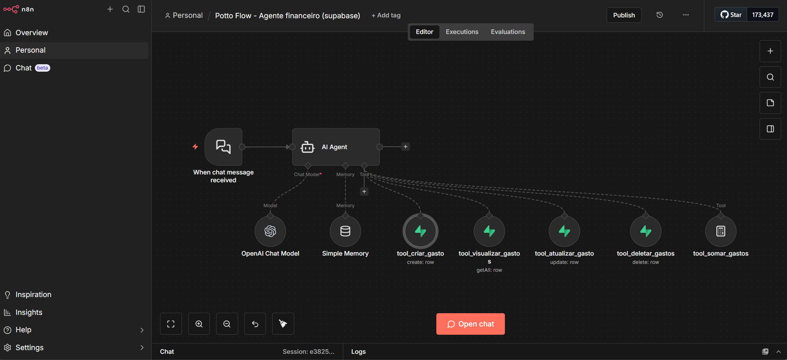

**Descrição:**  
Workflow de **Agente Financeiro Inteligente**, desenvolvido no **n8n**, que permite ao usuário **gerenciar gastos financeiros por chat**, utilizando **Inteligência Artificial, memória de contexto e Supabase como banco de dados**.

Este agente funciona como um **assistente financeiro conversacional**, capaz de registrar, consultar, atualizar, excluir e somar despesas de forma natural, segura e auditável, sendo ideal para **controle financeiro pessoal, familiar ou de pequenas empresas**.

**O que esse agente faz na prática:**
- Recebe mensagens via **Chat Trigger do n8n**
- Atua como **Assistente Financeiro Inteligente**, orientado por prompt estruturado
- Utiliza **LLM (OpenAI)** para entender comandos em linguagem natural
- Mantém **memória de conversa** para continuidade do atendimento
- Integra-se diretamente ao **Supabase** para persistência de dados
- Permite executar ações financeiras via chat:
  - 📊 **Visualizar gastos**
    - Lista nome, tipo e valor
    - Permite filtros por categoria ou período
  - ➕ **Adicionar novos gastos**
    - Classifica automaticamente o tipo se não informado
    - Categorias suportadas:
      - Mercado
      - Diversão
      - Comida
      - Educação
      - Assinatura
      - Transporte
  - ✏️ **Atualizar gastos existentes**
    - Confirma o registro antes de editar
    - Permite alterar nome, valor ou tipo
  - 🗑️ **Deletar gastos**
    - Confirmação obrigatória antes da exclusão
  - 🧮 **Somar gastos**
    - Total geral ou filtrado por tipo/período
- Evita ações incorretas com:
  - Confirmação de comandos críticos
  - Validação de registros existentes
- Retorna respostas **claras, organizadas e amigáveis**

Este fluxo cria um **sistema financeiro conversacional completo**, combinando **IA + banco de dados + automação**, pronto para uso real e escalável.

📁 **Workflow incluso:**  
`Potto_Flow___Agente_financeiro__supabase.json`

---

## 📈 Agente Automatizado para Geração de Leads (Google Maps → Planilha)


**Descrição:**  
Workflow de **geração automática de leads**, desenvolvido no **n8n**, que realiza **prospecção ativa de empresas no Google Maps**, extrai dados relevantes via **Outscraper API**, trata e normaliza as informações e salva os leads de forma estruturada em uma **planilha do Google Sheets**.

Este projeto é ideal para **times comerciais, SDRs, agências de marketing, pré-vendas e outbound**, permitindo criar listas qualificadas de leads com rapidez, escala e baixo esforço manual.

**O que esse workflow faz na prática:**
- Inicia manualmente via **Manual Trigger**
- Define parâmetros de busca dinamicamente:
  - 🔍 Tipo de negócio (ex: clínica de estética)
  - 📍 Localização (cidade/região)
- Executa requisição **HTTP POST** para a **Outscraper API (Google Maps Search)**
- Coleta dados enriquecidos das empresas, como:
  - Nome da empresa
  - Endereço completo
  - Telefone
  - Website
  - E-mails (principal e secundário, quando disponíveis)
  - Avaliação (rating)
  - Número de reviews
  - Categoria
  - Horário de funcionamento
- Processa e normaliza os dados via **Code Node (JavaScript)**:
  - Remove caracteres inválidos
  - Ajusta formatos de telefone
  - Garante consistência dos campos
- Registra automaticamente os leads em uma **planilha do Google Sheets**, com colunas bem definidas
- Estrutura pronta para:
  - Enriquecimento adicional
  - Integração com CRM
  - Automação de contato (WhatsApp, e-mail, etc.)

Este fluxo cria uma **máquina de geração de leads B2B**, escalável, reutilizável e facilmente adaptável para diferentes nichos e regiões.

📁 **Workflow incluso:**  
`Potto_Flow___Agente_para_gerar_leads.json`

---

### 📚 RAG Automático com Google Drive + Supabase (IA)

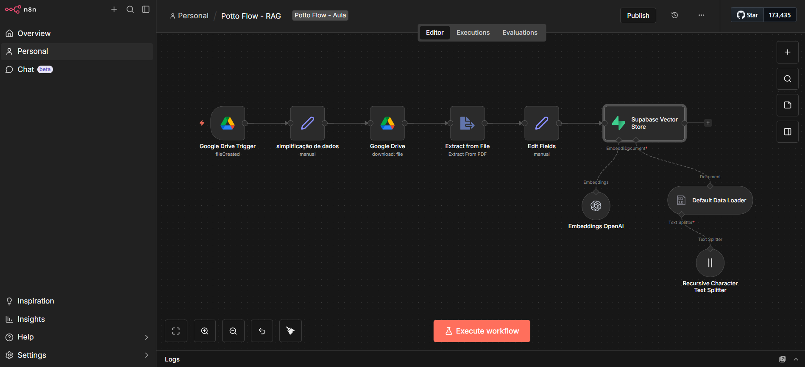

**Descrição:**  
Workflow completo de **RAG (Retrieval-Augmented Generation)** desenvolvido no **n8n**, responsável por **ingerir documentos automaticamente**, gerar **embeddings com IA** e armazená-los em um **Vector Store no Supabase**, criando uma **base de conhecimento consultável por agentes de IA**.

Este projeto é ideal para **chatbots inteligentes, assistentes corporativos, bases de conhecimento internas, suporte técnico e aplicações educacionais**, permitindo que a IA responda com base em documentos reais e atualizados.

**O que esse workflow faz na prática:**
- Monitora automaticamente uma **pasta específica no Google Drive**
- Detecta quando um **novo arquivo é adicionado** (ex: PDFs)
- Normaliza os metadados do arquivo:
  - ID do arquivo
  - Tipo (MIME)
  - Data de criação
- Faz o **download automático do documento**
- Extrai o texto do arquivo (**PDF → texto**)
- Prepara o conteúdo para indexação:
  - Limpeza
  - Padronização de campos
- Fragmenta o texto com **Recursive Character Text Splitter**
  - Controle de chunk size para melhor recuperação semântica
- Gera **embeddings utilizando OpenAI**
- Armazena documentos e vetores no **Supabase Vector Store**
  - Com metadados para rastreabilidade
- Estrutura pronta para:
  - Consulta via agentes de IA
  - Chatbots com contexto documental
  - Sistemas RAG escaláveis e auditáveis

Este fluxo cria uma **pipeline completa de ingestão e indexação RAG**, totalmente automatizada, robusta e pronta para uso em produção.

📁 **Workflow incluso:**  
`Potto_Flow___RAG.json`

---

## 🧩 Buscar ID de Grupos em Massa (Evolution API → Google Sheets)

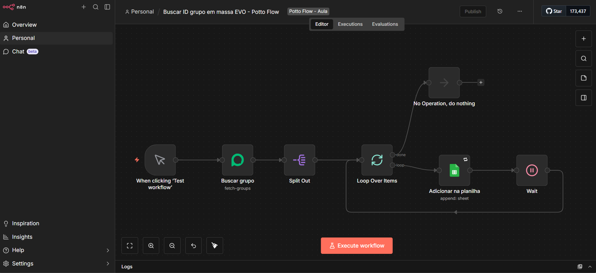

**Descrição:**  
Workflow utilitário desenvolvido no **n8n** para **listar e extrair automaticamente os IDs de todos os grupos** vinculados a uma instância da **Evolution API (WhatsApp)**, salvando essas informações de forma organizada em uma **planilha do Google Sheets**.

Este projeto é ideal para **operações de WhatsApp em escala**, times de automação, suporte técnico e desenvolvedores que precisam **mapear grupos ativos**, realizar auditorias, integrações posteriores ou preparar automações em massa baseadas em grupos.

**O que esse workflow faz na prática:**
- Inicia manualmente via **Manual Trigger** (modo teste ou execução controlada)
- Conecta-se à **Evolution API** utilizando credenciais configuradas
- Executa a operação **Fetch Groups** para buscar todos os grupos disponíveis na instância
- Retorna dados estruturados dos grupos, como:
  - 🆔 ID do grupo
  - 👥 Nome / assunto do grupo
- Realiza a separação dos registros com **Split Out**
- Processa os itens em lote com **Loop Over Items**
- Aplica controle de ritmo com **Wait Node** para evitar:
  - Limites de API
  - Bloqueios por excesso de requisições
- Registra automaticamente os dados em uma **planilha do Google Sheets**, com colunas:
  - `ID`
  - `Grupo`
- Fluxo seguro, simples e reutilizável para diferentes instâncias e contas

Este fluxo funciona como uma **ferramenta base de infraestrutura para automações com WhatsApp**, facilitando o gerenciamento, controle e uso estratégico de grupos em outros workflows.

📁 **Workflow incluso:**  
`Buscar_ID_grupo_em_massa_EVO___Potto_Flow.json`

---

## 🤖 Agente SDR Inteligente com CRM (Notion + Supabase)

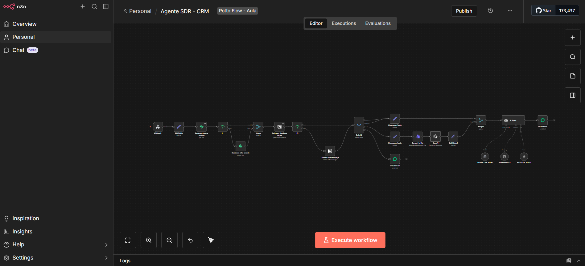

**Descrição:**  
Workflow de **Agente SDR Inteligente**, desenvolvido no **n8n**, responsável por **auxiliar o processo de pré-vendas e atendimento comercial**, integrando **Notion (CRM)** e **Supabase (banco de dados operacional)**.

Este agente atua como um **assistente de SDR**, organizando leads, atualizando status e mantendo os dados sincronizados entre CRM e banco de dados, garantindo **continuidade de atendimento e rastreabilidade das interações**.

**O que esse workflow faz na prática:**
- Centraliza a gestão de leads em um **CRM no Notion**
- Busca automaticamente todos os leads cadastrados:
  - Nome  
  - WhatsApp  
  - Status  
  - Resumo do atendimento
- Permite **qualificar leads**:
  - Atualiza status para **Atendimento Humano**
  - Registra resumo completo da conversa
  - Salva e-mail do lead
- Permite **encerrar leads perdidos**:
  - Atualiza status para **Perdido**
  - Registra resumo final da conversa
- Sincroniza informações críticas com o **Supabase**:
  - Status do lead
  - E-mail
- Mantém o histórico organizado para continuidade do processo comercial

Este fluxo é ideal para **times de SDR, pré-vendas, atendimento comercial e automações de CRM**, garantindo **processos claros, organizados e escaláveis**.

📁 **Workflow incluso:**  
`Agente SDR - CRM.json`

---

## 🧠 Agente SDR com MCP (CRM Inteligente via Tools)

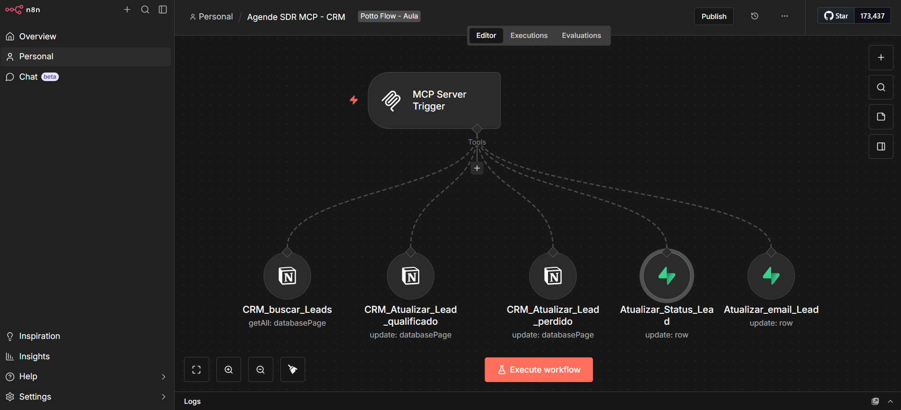

**Descrição:**  
Workflow avançado de **Agente SDR com MCP (Model Context Protocol)**, desenvolvido no **n8n**, que expõe o CRM como **ferramentas (Tools)** para um **Agente de IA**, permitindo que o próprio agente **decida quando buscar, atualizar ou encerrar leads automaticamente**.

Este projeto representa uma **arquitetura moderna de automação orientada a agentes**, onde a IA possui **controle ativo sobre o CRM**, simulando o comportamento de um **SDR humano experiente**, com autonomia e lógica contextual.

**O que esse workflow faz na prática:**
- Expõe o CRM como **Tools via MCP Server Trigger**
- Permite que o **Agente de IA** execute ações como:
  - 🔍 Buscar todos os leads no CRM (Notion)
  - ✅ Qualificar leads automaticamente
  - ❌ Marcar leads como perdidos
  - ✏️ Atualizar e-mails e status no Supabase
- Mantém **sincronização bidirecional** entre:
  - Notion (CRM)
  - Supabase (banco operacional)
- Garante consistência dos dados em tempo real
- Facilita integração com:
  - Chatbots
  - Assistentes comerciais
  - Fluxos de atendimento automatizado

Este fluxo é ideal para **operações comerciais inteligentes**, **SDRs automatizados**, **assistentes de vendas com IA** e arquiteturas baseadas em **Agentic AI + MCP**, prontas para escala e produção.

📁 **Workflow incluso:**  
`Agende SDR MCP - CRM.json`

---

## 🚗 Agente de Concessionária de Automóveis com IA (WhatsApp)

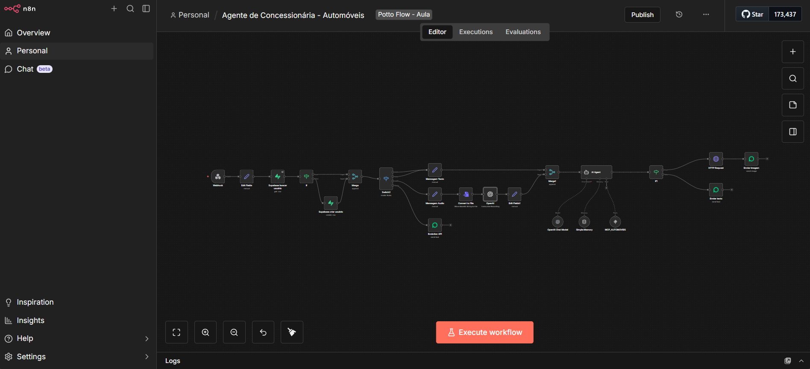

**Descrição:**  
Workflow completo de **Agente de Atendimento Inteligente para Concessionárias**, desenvolvido no **n8n**, projetado para **atender clientes interessados na compra de veículos via WhatsApp**, utilizando **Inteligência Artificial, banco de dados estruturado e envio automático de imagens**.

Este agente simula o comportamento de um **vendedor humano**, entendendo as necessidades do cliente, buscando veículos disponíveis e apresentando opções de forma clara, educada e contextual.

**O que esse workflow faz na prática:**
- Recebe mensagens via **Webhook (WhatsApp – Evolution API)**
- Normaliza dados do cliente:
  - Nome
  - WhatsApp
  - Mensagem enviada
- Busca ou cria automaticamente o cliente no **Supabase (CRM)**
- Identifica o tipo de mensagem recebida:
  - 💬 Texto
  - 🎙️ Áudio (com transcrição automática via IA)
- Utiliza **Agente de IA (LLM)** com:
  - Prompt especializado para vendas de automóveis
  - Memória por usuário (histórico de conversa)
  - Integração com **Tools MCP**
- Consulta veículos disponíveis conforme critérios do cliente:
  - Preço máximo
  - Modelo / marca
  - Ano
- Retorna lista de veículos disponíveis de forma clara
- Quando solicitado, envia **imagens reais dos veículos** automaticamente
- Responde via **WhatsApp**, com texto ou mídia, conforme o contexto

Este fluxo é ideal para **concessionárias, lojas de veículos e operações comerciais automotivas**, oferecendo **atendimento escalável, inteligente e orientado à conversão**.

📁 **Workflow incluso:**  
`Agente de Concessionária - Automóveis.json`

---

## 🧠 MCP Concessionária (CRM Automotivo via Tools)

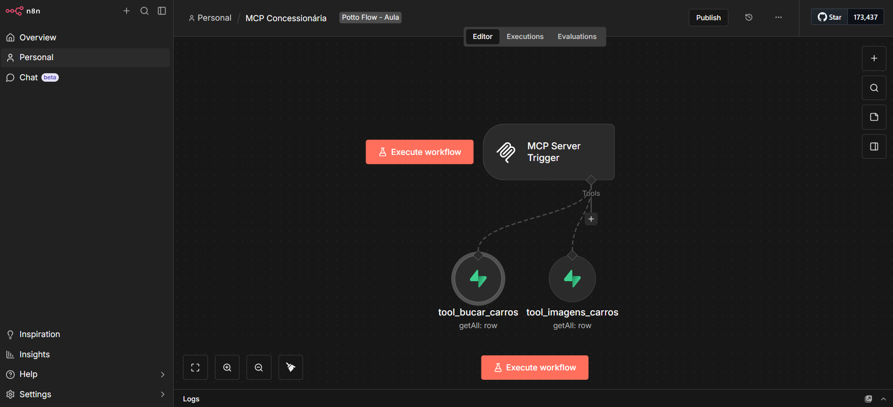

**Descrição:**  
Workflow de **MCP Server (Model Context Protocol)** para Concessionárias, desenvolvido no **n8n**, responsável por **expor o banco de dados automotivo como ferramentas (Tools)** para Agentes de IA.

Este projeto transforma o **CRM da concessionária em uma API inteligente**, permitindo que agentes tomem decisões autônomas sobre **busca de veículos e envio de imagens**, com base em critérios definidos pelo cliente.

**O que esse workflow faz na prática:**
- Cria um **MCP Server Trigger** no n8n
- Expõe o banco de dados de veículos no **Supabase** como Tools:
  - 🔍 **tool_buscar_carros**
    - Pesquisa veículos disponíveis por:
      - Valor
      - Modelo
      - Marca
      - Ano
  - 🖼️ **tool_imagens_carros**
    - Retorna **URLs diretas das imagens** dos veículos
- Garante que o agente:
  - Nunca invente preços ou modelos
  - Utilize apenas dados reais do banco
- Retorna **somente a URL da imagem** quando solicitado
- Estrutura preparada para integração com:
  - Agentes de IA conversacionais
  - Chatbots de vendas
  - Fluxos comerciais automatizados

Este fluxo representa uma **arquitetura moderna baseada em Agentic AI + MCP**, ideal para **operações comerciais avançadas**, CRM inteligente e automações orientadas a contexto.

📁 **Workflow incluso:**  
`MCP Concessionária.json`

---

## 📸 Template de Atendimento Automático para Instagram com IA

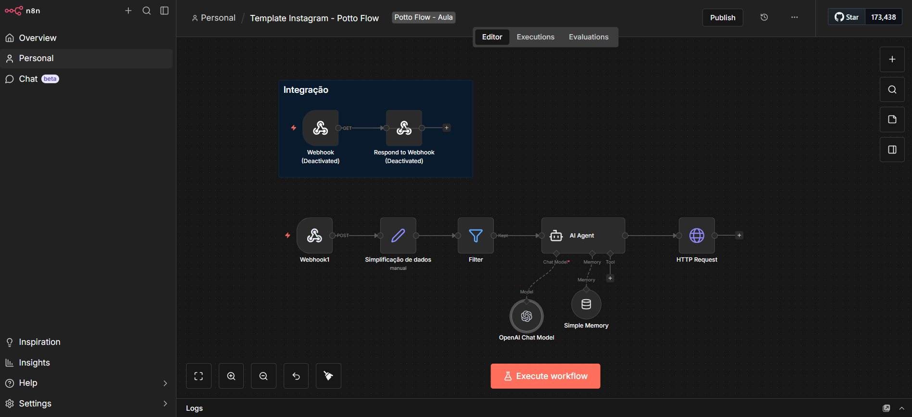

**Descrição:**  
Workflow template de **atendimento automatizado para Instagram**, desenvolvido no **n8n**, projetado para **receber, interpretar e responder mensagens diretas (DMs) automaticamente**, utilizando **Inteligência Artificial, memória de conversa e integração direta com a API do Instagram**.

Este projeto serve como **base reutilizável** para criação de **assistentes de atendimento, vendas ou engajamento em redes sociais**, permitindo rápida adaptação para diferentes nichos e estratégias.

**O que esse workflow faz na prática:**
- Recebe eventos do **Instagram Webhook** (mensagens diretas)
- Realiza validação inicial do webhook (GET + hub.challenge)
- Processa mensagens recebidas via **POST**
- Normaliza os dados da conversa:
  - ID do remetente
  - ID da conta do Instagram
  - Conteúdo da mensagem
- Filtra mensagens inválidas:
  - Mensagens enviadas pela própria conta
- Utiliza **Agente de IA (LLM)** com:
  - Prompt configurável por negócio
  - Memória por usuário (continuidade de conversa)
- Gera respostas automáticas:
  - Contextuais
  - Naturais
  - Alinhadas à estratégia definida no prompt
- Envia respostas diretamente para o **Instagram DM** via **HTTP Request**
- Estrutura modular pronta para:
  - Atendimento
  - Pré-vendas
  - Engajamento automático
  - Social Media com IA

Este template é ideal para **criadores de conteúdo, empresas, social medias e agências**, servindo como **ponto de partida profissional** para automações avançadas no Instagram com IA.

📁 **Workflow incluso:**  
`Template_Instagram___Potto_Flow.json`

---

## 💬 Template de Resposta Automática a Comentários no Instagram com IA

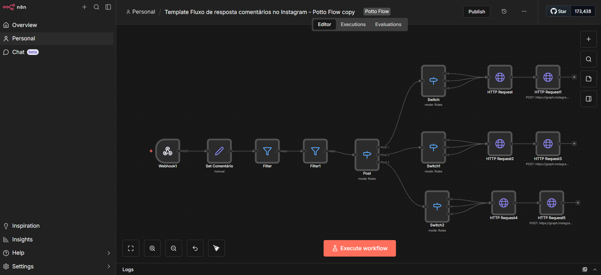

**Descrição:**  
Workflow template de **resposta automática a comentários no Instagram**, desenvolvido no **n8n**, projetado para **monitorar comentários em posts**, interpretar o conteúdo com **Inteligência Artificial** e **responder automaticamente de forma contextual**, mantendo engajamento ativo e imediato.

Este projeto é ideal para **marcas, criadores de conteúdo, infoprodutores, social medias e equipes de marketing**, permitindo escalar interações públicas no Instagram sem perder personalização ou timing.

**O que esse workflow faz na prática:**
- Recebe eventos do **Instagram Webhook** relacionados a novos comentários
- Realiza validações iniciais de segurança e origem do evento
- Normaliza os dados do comentário:
  - ID do post
  - ID do comentário
  - Texto do comentário
  - ID do usuário
- Aplica filtros para:
  - Evitar respostas duplicadas
  - Ignorar comentários da própria conta
- Utiliza **regras condicionais (Switch / If)** para classificar o tipo de comentário:
  - Dúvidas
  - Interesse em produto/serviço
  - Comentários genéricos
  - Engajamento simples (ex: “🔥”, “top”, “amei”)
- Gera respostas automáticas via **Agente de IA (LLM)**:
  - Linguagem natural
  - Alinhada ao posicionamento da marca
  - Personalizada conforme o contexto do comentário
- Envia a resposta diretamente como **reply ao comentário** via **Instagram Graph API**
- Estrutura pronta para:
  - CTA em comentários
  - Direcionamento para DM
  - Estratégias de engajamento e conversão

Este template cria uma **máquina de engajamento automático no Instagram**, aumentando alcance, relevância e velocidade de resposta, com **IA aplicada de forma estratégica e segura**.

📁 **Workflow incluso:**  
`Template Fluxo de resposta comentários no Instagram - Potto Flow copy.json`

---

## 🚀 Agente de Vendas Inteligente (Arquitetura Modular)

Este conjunto de projetos representa uma **arquitetura modular de Agente de Vendas com IA**, construída no **n8n**, utilizando:

- Supabase (base de produtos)
- Evolution API (WhatsApp)
- LLM (OpenAI)
- Memória contextual
- Orquestração entre workflows

A estrutura foi dividida em **3 workflows especializados**, permitindo escalabilidade, clareza arquitetural e reaproveitamento em múltiplos cenários comerciais.

---

# 🧠 Agente de Vendas 01 (Orquestrador Inteligente)

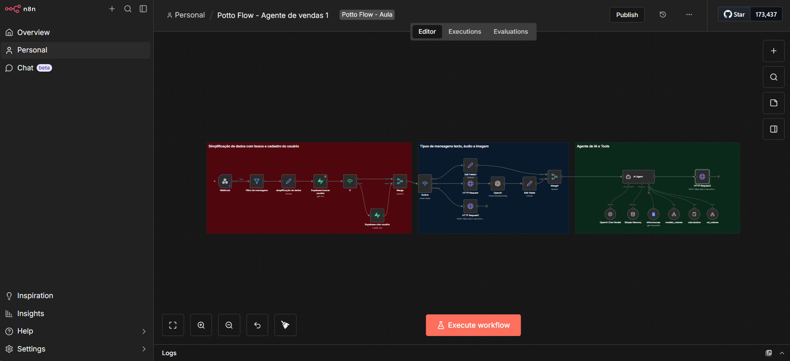

**Descrição:**  
Workflow principal responsável por atuar como **Agente de IA Orquestrador**, interpretando a intenção do usuário e decidindo qual subfluxo deve ser acionado (imagem ou URL do produto).

Este fluxo centraliza a lógica conversacional e a tomada de decisão estratégica.

### 🔎 O que esse workflow faz na prática:

- Recebe dados via execução por outro workflow
- Normaliza:
  - Nome
  - WhatsApp
  - Mensagem
- Utiliza **Agente de IA (LLM)** com:
  - Prompt estruturado
  - Memória por usuário
  - Tool Calling
- Identifica a intenção do cliente:
  - Solicitação de imagens do produto
  - Solicitação de link/URL do produto
- Aciona automaticamente:
  - Workflow de envio de imagens
  - Workflow de envio de URL
- Retorna resposta contextual ao fluxo principal

Este workflow funciona como o **cérebro da operação comercial automatizada**, garantindo coerência e inteligência na experiência do cliente.

📁 **Workflow incluso:**  
`Potto_Flow___Agente_de_vendas_1.json`

---

# 🖼️ Agente de Vendas 02 (Envio Inteligente de Imagens)

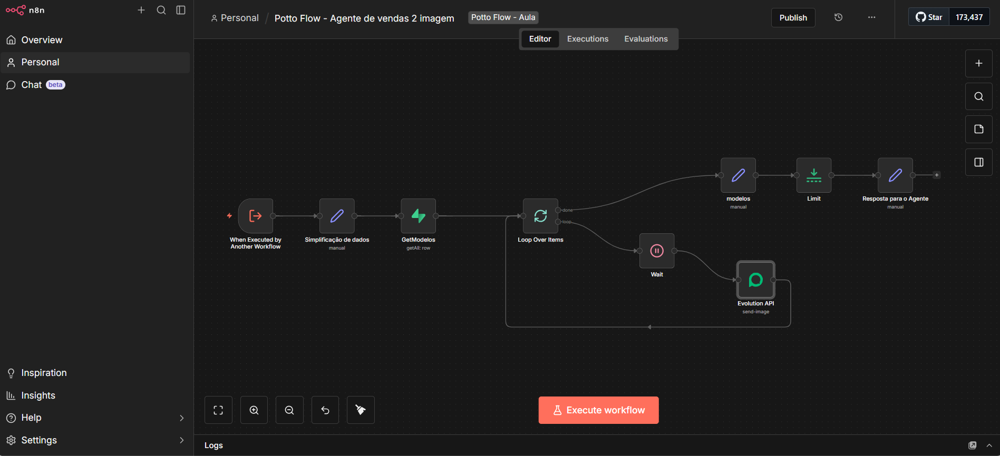

**Descrição:**  
Workflow especializado em **envio automático de imagens de produtos via WhatsApp**, com controle de ritmo, limite de envios e retorno estruturado ao agente principal.

Ideal para operações comerciais que precisam apresentar **catálogos visuais de forma automatizada**.

### 🔎 O que esse workflow faz na prática:

- Recebe dados do workflow principal
- Busca todos os produtos na tabela **Produtos (Supabase)**
- Processa itens com:
  - `Loop Over Items`
  - Controle de envio sequencial
- Envia imagens via **Evolution API (WhatsApp)**:
  - Imagem do produto
  - Nome
  - Preço na legenda
- Aplica:
  - `Wait Node` para evitar bloqueios
  - `Limit Node` para controle de quantidade
- Retorna ao agente principal mensagem solicitando:
  - Qual modelo o cliente mais gostou

Esse fluxo cria uma **experiência de vitrine automatizada via WhatsApp**, mantendo fluidez e profissionalismo.

📁 **Workflow incluso:**  
`Potto_Flow___Agente_de_vendas_2_imagem (1).json`

---

# 🔗 Agente de Vendas 03 (Envio Inteligente de URL)

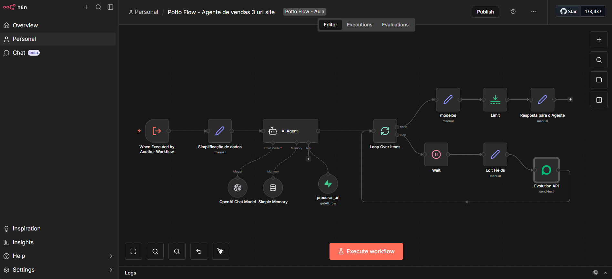

**Descrição:**  
Workflow responsável por **buscar e enviar automaticamente a URL do produto solicitado**, utilizando **Agente de IA + Tool Calling + Supabase**.

Este fluxo permite que o agente entregue **links de pagamento ou páginas de produto de forma 100% contextual e automatizada**.

### 🔎 O que esse workflow faz na prática:

- Recebe dados do workflow principal
- Normaliza informações do usuário
- Utiliza **Agente de IA (LLM)** com:
  - Memória por WhatsApp
  - Tool integrada ao Supabase
- Ativa tool `procurar_url` para:
  - Buscar produto correspondente
  - Recuperar campo URL
- Retorna **apenas o link do produto**
- Envia automaticamente via **Evolution API (WhatsApp)**
- Controla fluxo com:
  - Loop
  - Wait
  - Limit

Esse workflow garante que:

- O agente nunca invente links
- O link seja sempre real e vindo do banco
- O envio seja rápido e contextual

Ideal para:

- Checkout automatizado
- Envio de links de pagamento
- Vendas diretas via WhatsApp
- Operações de infoproduto e e-commerce

📁 **Workflow incluso:**  
`Potto_Flow___Agente_de_vendas_3_url_site.json`

---

## 🏗️ Arquitetura do Agente de Vendas

Essa estrutura modular permite:

- Separação clara de responsabilidades
- Escalabilidade
- Fácil manutenção
- Reaproveitamento de subfluxos
- Arquitetura orientada a agentes

### 🔄 Fluxo macro:

Cliente → Agente Orquestrador (IA)
↓
Decide intenção
↙ ↘
Envio de Imagens Envio de URL
↘ ↙
Resposta contextual

---

## 🎯 Aplicações Reais

Essa arquitetura pode ser aplicada em:

- E-commerce via WhatsApp
- Lojas de roupas
- Concessionárias
- Infoprodutores
- Catálogos digitais
- Vendas consultivas automatizadas
- Operações B2C e B2B

---

## 📞 Análise Inteligente de Ligações Comerciais com IA (VoIP + Transcrição + E-mail)

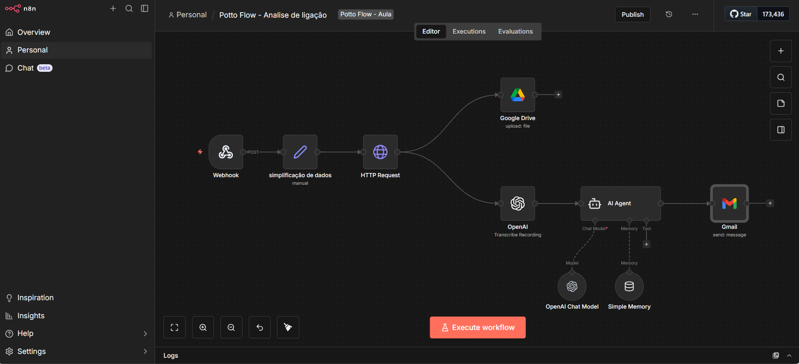

**Descrição:**  
Workflow completo de **análise automática de ligações comerciais**, desenvolvido no **n8n**, que recebe gravações via **Webhook (VoIP)**, realiza **transcrição com IA**, aplica **análise inteligente da conversa** e envia um **resumo estruturado por e-mail para o diretor comercial e responsável pela venda**.

Este fluxo é ideal para **equipes de vendas, gestores comerciais, operações de call center e pré-vendas**, permitindo auditoria, acompanhamento de performance e melhoria contínua da abordagem comercial.

---

### 🔎 O que esse workflow faz na prática:

- Recebe dados da ligação via **Webhook (POST)**:
  - ID da chamada  
  - Número do caller  
  - Número chamado  
  - Duração  
  - URL da gravação  
- Normaliza os dados automaticamente via **Set Node**
- Faz download da gravação utilizando **HTTP Request**
- Salva automaticamente o áudio no **Google Drive** (organização e auditoria)
- Realiza **transcrição automática do áudio** com OpenAI
- Utiliza **Agente de IA (LLM)** com:
  - Prompt estruturado para análise comercial
  - Classificação de sentimento
  - Interpretação da intenção do lead
- Mantém memória contextual por número de telefone
- Gera um **resumo estruturado da ligação**
- Envia automaticamente um **e-mail formatado em HTML**, contendo:
  - 📄 Transcrição completa
  - 📊 Análise da conversa
  - 🔎 Indícios de interesse do lead
  - 📌 Espaço para definição de próximas ações
- Dispara notificação para o **diretor comercial e vendedor responsável**

---

### 🧠 Inteligência Aplicada

Este workflow permite:

- Monitoramento de qualidade de atendimento  
- Identificação de oportunidades perdidas  
- Classificação de leads por sentimento  
- Registro estruturado de interações comerciais  
- Base para métricas futuras (conversão por vendedor, tom da conversa, objeções recorrentes)

---

### 🏗️ Arquitetura Técnica

- Webhook (VoIP)  
- HTTP Request (download da gravação)  
- Google Drive (armazenamento)  
- OpenAI (Transcrição de Áudio)  
- AI Agent (análise comercial)  
- OpenAI Chat Model  
- Memory Buffer  
- Gmail (envio automático estruturado)

---

### 🎯 Aplicações Reais

- Call centers  
- Operações de SDR  
- Vendas consultivas  
- Auditoria comercial  
- Gestão de equipes de pré-vendas  
- Monitoramento de performance comercial  

---

📁 **Workflow incluso:**  
`Potto_Flow___Analise_de_ligação_comercial.json`

---

## ⭐ Projeto em Destaque

### 📊 A Tríade — IA para Análise de Ações

Projeto **backend em Python** que integra **dados financeiros**, **notícias de mercado** e **Inteligência Artificial** para apoiar **análise de ações e tomada de decisão**.

**Pilares:**
- 📈 Dados de mercado  
- 📰 Contexto informacional  
- 🤖 Raciocínio estruturado com LLMs  

**Destaques técnicos:**
- API REST com **FastAPI**
- Arquitetura em camadas (**API, Services, AI, Schemas**)
- **Prompt Engineering** com structured outputs
- Base pronta para **RAG** e **agentes autônomos**
- Projeto **containerizado**

**Stack:**


---

## 🚀 Outros Projetos Relevantes

### 📄 OCR Document API — Full Stack

Aplicação **Full Stack** para **upload de imagens**, **extração de texto via OCR**, **persistência em banco de dados** e **busca textual**.

**Destaques técnicos:**
- OCR aplicado (**Computer Vision**)
- API REST
- Persistência relacional
- Arquitetura **containerizada**

### 🎨 Frontend


#### 🌐 Backend


---

### 🚀 Antigravity Financial — Plataforma Financeira com IA

Aplicação **web completa** construída com **FastAPI + Uvicorn**, **Docker** e **Docker Compose**, utilizando **Cloudflare D1** como banco de dados e **Redis** para **rate limiting**.

**Funcionalidades:**
- Autenticação completa (**Login, Registro, Logout**) com **JWT**
- **Rate limiting** com Redis (proteção contra força bruta)
- **Admin Panel** para aprovação de usuários
- **Dashboard financeiro** (Ações, FX e Cripto)
- Normalização de dados financeiros (**Base 100**)
- Integração com **Cloudflare D1 (REST API)** e **Financial Modeling Prep API**

**Destaques técnicos:**
- Arquitetura backend organizada por camadas
- Integração com serviços externos via API
- Segurança e controle de acesso
- Aplicação **containerizada** e pronta para produção

**Stack:**


---

## 🧾 Sistema de Cadastro de Usuários — Full Stack

Aplicação **Full Stack** para **cadastro, autenticação e gerenciamento de usuários**, construída com foco em **boas práticas de engenharia de software**, **organização de código**, **segurança básica** e **infraestrutura preparada para produção**.

O projeto demonstra domínio em **arquitetura Full Stack moderna**, **API REST**, **persistência de dados**, **containerização** e **deploy**.

---

## 🚀 Funcionalidades

- Cadastro de usuários
- Login e autenticação
- Validação de dados no backend
- Persistência em banco de dados relacional
- Arquitetura simples, organizada e escalável

---

## 🧠 Destaques Técnicos

- API REST bem definida
- Separação clara de responsabilidades:
  - `routes`
  - `controllers`
  - `services`
- Validações centralizadas no backend
- Projeto **containerizado**
- Base preparada para evolução com:
  - JWT
  - Refresh Tokens
  - RBAC (Role-Based Access Control)
- Infraestrutura pronta para ambientes reais

---

## 🛠️ Stack Tecnológica

### 🎨 Frontend
- **Next.js**
- **React**
- **TypeScript**
- **CSS / CSS Modules**
- Deploy moderno com **Vercel**


---

### 🌐 Backend
- **Node.js**
- **Express**
- **TypeScript**
- Arquitetura em camadas
- Validações no servidor


---

### 🗄️ Dados
- **PostgreSQL**
- **SQL**
- Persistência relacional
- Modelagem simples e eficiente


---

### ⚙️ Infraestrutura & Deploy
- **Docker**
- **Docker Compose**
- **Traefik** como proxy reverso
- Ambientes isolados e reproduzíveis
- Pronto para produção


---

### 🔗 Comunicação
- **API REST**
- Comunicação via HTTP
- Integração Frontend ↔ Backend
- Base pronta para autenticação e autorização

---

## 🎯 Objetivo do Projeto

Demonstrar capacidade prática em:
- Desenvolvimento **Full Stack**
- Arquitetura de APIs
- Organização e escalabilidade de código
- Infraestrutura moderna com containers
- Deploy profissional (Vercel + Docker + Traefik)

---

⭐ Projeto desenvolvido para portfólio técnico, entrevistas e evolução para aplicações de produção.

---

## 🖼️ Projeto Galeria de Imagens — Full Stack

O **Projeto Galeria de Imagens** é uma aplicação **Full Stack** desenvolvida para demonstrar **boas práticas de arquitetura**, **organização de código** e **separação clara de responsabilidades** entre **Frontend, Backend, Banco de Dados e Infraestrutura**.

O projeto foi concebido com foco em **escalabilidade**, **modularidade** e **preparação para produção**, sendo ideal tanto para **estudos avançados** quanto para **portfólio profissional**.

---

## 🚀 Funcionalidades

- 📸 Upload e exibição de imagens  
- 🗂️ Galeria organizada e responsiva  
- 🌐 Comunicação entre camadas via **API REST**  
- 🧩 Componentização e reutilização de templates  
- 📦 Build otimizado para frontend  
- 🐳 Ambiente totalmente containerizado  
- ⚡ Estrutura pronta para deploy  

---

## 🧠 Destaques Técnicos

- Arquitetura Full Stack bem definida
- Separação clara de responsabilidades:
  - Frontend
  - Backend
  - Banco de Dados
  - Infraestrutura
- Comunicação via API REST
- Build frontend com bundler moderno
- Containerização completa com Docker
- Base preparada para CI/CD e cloud

---

## 🛠️ Stack Tecnológica

### 🎨 Frontend
- **HTML5**
- **CSS3**
- **JavaScript**
- **Bootstrap**
- **jQuery**
- Templates reutilizáveis
- Layout responsivo


---

### 📦 Build & Bundler
- **Webpack**
- Build otimizado para produção
- Geração de bundle final


---

### 🌐 Backend
- **Node.js**
- **TypeScript**
- **Express**
- API REST estruturada
- Organização em camadas:
  - controllers
  - routes
  - services


---

### 🗄️ Banco de Dados
- **PostgreSQL**
- Persistência relacional
- Modelagem simples e eficiente


---

### ⚙️ Infraestrutura & DevOps
- **Docker**
- **Docker Compose**
- Ambientes isolados e reproduzíveis
- Orquestração de múltiplos serviços
- Base preparada para deploy em cloud


---

## 📂 Estrutura do Projeto

```
projeto-galeria/
│
├── backend/
│   ├── src/
│   │   ├── controllers/
│   │   ├── routes/
│   │   ├── services/
│   │   └── app.ts
│   ├── Dockerfile
│   └── package.json
│
├── frontend/
│   ├── src/
│   │   ├── js/
│   │   ├── styles/
│   │   └── templates/
│   ├── build/
│   │   ├── imgs/
│   │   ├── bundle.js
│   │   └── index.html
│   ├── webpack.config.js
│   └── package.json
│
├── docker-compose.yml
├── .gitignore
└── README.md
```
▶️ Como Executar o Projeto
🐳 Executar com Docker
bash
copiar código
docker-compose up --build
💻 Executar Manualmente
Backend
bash
copiar código
cd backend
npm install
npm run dev
Frontend
bash
copiar código
cd frontend
npm install
npm run build
Abra no navegador:

bash
copiar código
frontend/build/index.html

🎯 Objetivo do Projeto
Demonstrar domínio em desenvolvimento Full Stack

Aplicar arquitetura organizada e escalável

Utilizar API REST

Trabalhar com Docker e Docker Compose

Servir como projeto sólido de portfólio profissional

🔮 Evoluções Futuras
🔐 Autenticação com JWT

☁️ Upload de imagens em cloud

⚛️ Migração para React ou Vue

📊 Dashboard administrativo

🚀 Pipeline CI/CD

👨‍💻 Autor: Diego Hugo

⭐ Se este projeto te ajudou ou inspirou, considere deixar uma estrela!


---

## 📊 GitHub Stats


---

## 📫 Onde me encontrar

- 💼 LinkedIn: https://linkedin.com/in/diegohrocha  
- 🐙 GitHub: https://github.com/diegohugo570  

---
⭐ Se algum projeto te ajudou, considere deixar uma estrela!
