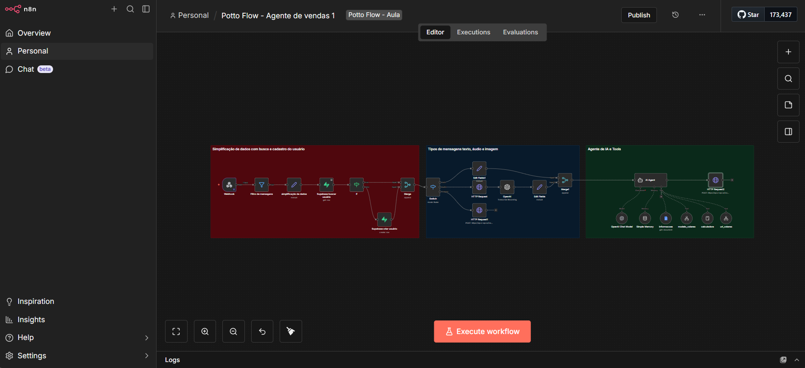
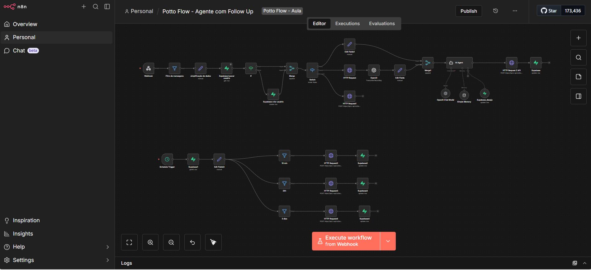
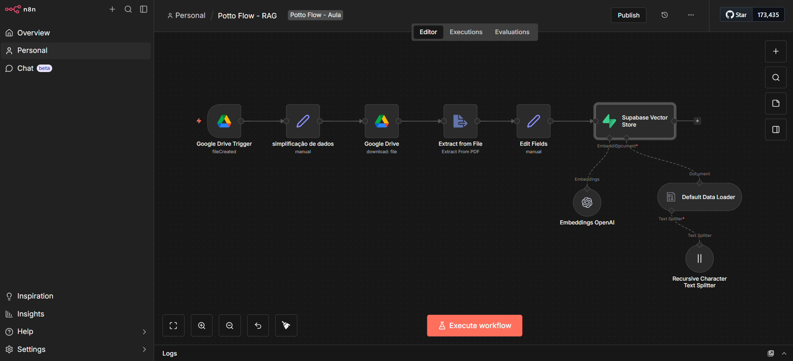
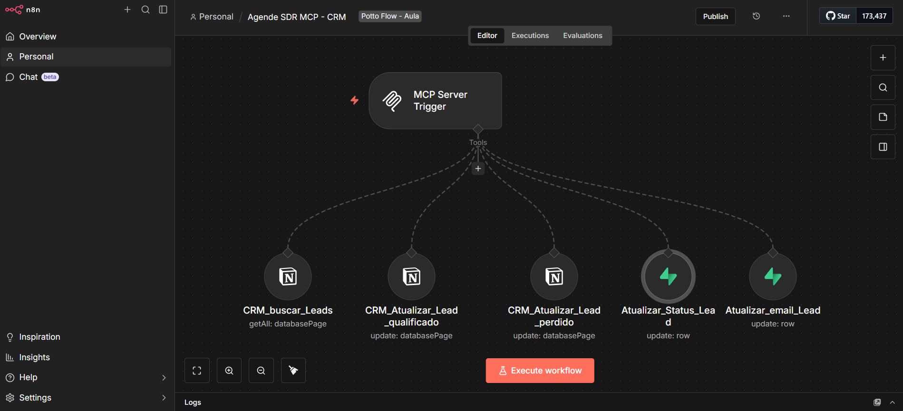

<!-- Banner -->
<p align="center">
  
</p>

<!-- Selos -->
<p align="center">
  
  
  
</p>

<h3 align="center">Construindo agentes de IA e automações que funcionam em produção</h3>

---

## 👨‍💻 Sobre mim

```text
Diego Hugo, AI Engineer e desenvolvedor Full Stack em São Paulo.
Foco em IA aplicada a negócios e marketing digital: agentes, RAG e automações.
Formação multidisciplinar: Engenharia Civil, Administração e Economia.

Stack principal: Python · LangGraph · n8n · FastAPI · Supabase · Docker
```

---

## 🛠️ Stack

| Categoria | Tecnologias |
|---|---|
| **IA & Agentes** |       |
| **Automação** |    |
| **Backend** | [](https://skillicons.dev) |
| **Frontend** | [](https://skillicons.dev) |
| **Dados** | [](https://skillicons.dev) |
| **DevOps & Tools** | [](https://skillicons.dev) |

---

## ⭐ Projetos em destaque

### 🧠 Agente de Vendas Modular (n8n + Supabase + WhatsApp)

<p align="center">
  
</p>

Arquitetura de 3 workflows: um **agente orquestrador** interpreta a intenção do cliente e aciona subfluxos de envio de imagens ou de link do produto. Memória por usuário, tool calling e dados sempre vindos do banco (o agente não inventa preços nem links).

`n8n` · `OpenAI` · `Supabase` · `Evolution API`

---

### 🤖 Agente de Atendimento com Follow-up (WhatsApp)

<p align="center">
  
</p>

Atende texto, áudio (transcrição automática) e imagem, mantém memória da conversa, identifica a intenção do lead e dispara follow-ups após 10 minutos, 24 horas e 3 dias.

`n8n` · `LLM` · `Supabase` · `Z-API`

---

### 📚 RAG automático (Google Drive → Supabase Vector Store)

<p align="center">
  
</p>

Pipeline de ingestão: detecta novos PDFs no Drive, extrai o texto, faz chunking, gera embeddings e indexa no Supabase com metadados, deixando a base pronta para ser consultada por agentes.

`n8n` · `OpenAI Embeddings` · `Supabase (pgvector)`

---

### 🔌 Agente SDR com MCP (CRM como Tools)

<p align="center">
  
</p>

O CRM (Notion + Supabase) é exposto como ferramentas via **MCP Server**, e o agente decide sozinho quando buscar, qualificar ou encerrar leads, mantendo os dois sistemas sincronizados.

`n8n` · `MCP` · `Notion` · `Supabase`

---

### 📊 A Tríade — IA para análise de ações

Backend em **Python/FastAPI** que combina dados de mercado, notícias e LLMs com saída estruturada para apoiar a análise de ações. Arquitetura em camadas (API, Services, AI, Schemas) e containerizado.

`Python` · `FastAPI` · `Pydantic` · `Poetry` · `OpenAI` · `Docker`

> 🔗 [Código](https://github.com/diegohugo570/NOME-DO-REPOSITORIO)

---

## 🗂️ Mais projetos

<details>
<summary><b>🔁 Workflows n8n (clique para expandir)</b></summary>

<br>

| Workflow | O que faz |
|---|---|
| Resumo de e-mails | Resume o Gmail diariamente com pontos-chave e ações |
| Triagem de currículos | Lê PDFs do Drive, compara com a vaga e registra a nota no Sheets |
| Geração de contratos | Preenche modelo no Google Docs, converte em PDF e envia por WhatsApp |
| Agente financeiro | Registra, consulta e soma gastos por chat, com Supabase |
| Geração de leads | Google Maps → Outscraper → Google Sheets |
| Concessionária com IA | Busca veículos por critério e envia imagens via WhatsApp |
| Análise de ligações | Transcreve gravações VoIP e envia análise comercial por e-mail |
| Instagram | Respostas automáticas a DMs e comentários com IA |
| Recuperação de checkout | Funil de WhatsApp com timers para infoprodutos |

</details>

<details>
<summary><b>🌐 Projetos Full Stack</b></summary>

<br>

- **Antigravity Financial** — FastAPI, JWT, Redis (rate limiting), Cloudflare D1, dashboard financeiro
- **OCR Document API** — upload de imagens, OCR, busca textual (React + Node + PostgreSQL)
- **Sistema de Cadastro de Usuários** — Next.js, Node/Express, PostgreSQL, Docker + Traefik
- **Galeria de Imagens** — Node/TypeScript, Webpack, PostgreSQL, Docker Compose

</details>

<details>
<summary><b>🐍 Estudos práticos em Python & IA</b></summary>

<br>

Text2SQL Agent · API profissional com FastAPI · Prompt Packer · Persistent Chat History · Token Cost Calculator · Model Provider SDK · Simple Vector Store · Fine-Tuning Dataset Prepper · Token Usage Dashboard · CLI Assistant com agente

</details>

---

## 📊 GitHub Stats

<p align="center">
  
  
</p>

---

## 📫 Contato

<p align="center">
  <a href="https://linkedin.com/in/diegohrocha"></a>
  <a href="https://github.com/diegohugo570"></a>
</p>
